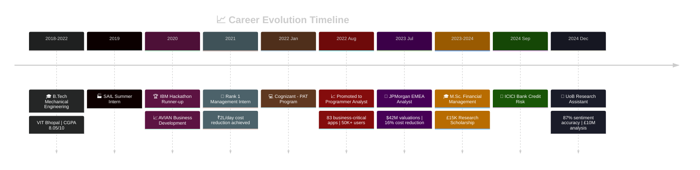

# 💼 Abhishek Nayak
## Finance × Technology Hybrid | Ex-JPMorgan | AI/ML Researcher

### Turning alpha, beta, gamma to 101010101

 

**📍 Bangalore, India** | **🎓 M. Sc. Financial Management (3.3/4.0)** | **🟢 Open to Opportunities**

---

## ✨ Quick Impact Dashboard

| 💰 Deal Valuations | 🤖 ML Accuracy | 👥 Users Impacted | 📚 Research | 💼 Cash Analysis | 📊 Cost Savings |
|: ---:|:---:|:---:|:---:|:---:|:---:|
| **$42M+** | **87%** | **50K+** | **2 Papers** | **£10M+** | **£4. 5M** |

---

## 🎯 Current Focus

> **Building AI-powered systems at the intersection of finance, sustainability, and regulatory technology**

### 🔬 ESG Risk Assessment Framework
Leading development of AI-powered monitoring systems for cross-regulatory compliance across SEBI and RBI guidelines at University of Birmingham.  Creating comprehensive frameworks for corporate ESG evaluation with real-time compliance tracking.

### 📈 ML-Driven Financial Analytics  
Developing advanced sentiment analysis models achieving 87% correlation between media sentiment and UK banking sector liquidity patterns. Combining NLP with sophisticated financial modeling for institutional-grade analysis.

---

## 👥 Collaboration & Learning

<table>
<tr>
<td width="50%">

### 🤝 I'm Looking to Collaborate On

- **FinTech Projects**: Payment systems, algorithmic trading, risk management platforms
- **AI/ML in Finance**: Sentiment analysis, predictive modeling, automated trading
- **ESG Tech Solutions**:  Sustainability reporting, carbon tracking, ESG scoring
- **Open Source**:  Financial tools, modeling frameworks, market analysis libraries
- **Quantitative Research**: IPO analysis, market efficiency, macroeconomic modeling

</td>
<td width="50%">

### 🌱 I'm Currently Learning

- Advanced NLP techniques for financial document analysis
- Time Series Forecasting (ARIMA, GARCH, Neural Networks)
- Cloud-native development (Docker, Kubernetes)
- Regulatory Technology (RegTech) frameworks
- Derivatives pricing & portfolio optimization
- Transformer models for financial intelligence

</td>
</tr>
</table>

### 💬 Ask Me About

**Investment Banking** | **Financial Modeling** | **Credit Risk** | **Python for Finance** | **Database Optimization** | **ESG Analytics** | **Software Engineering**

---

## 🚀 Professional Journey

---

## 💼 Professional Experience

<b>🔬 University of Birmingham - Postgraduate Research Assistant</b> (Sep 2023 - Present)

### 🌍 ESG Market Analysis & Risk Assessment
- **Cross-Regulatory Compliance Framework**:  Developing AI-powered monitoring for SEBI & RBI guidelines
- **Impact**:  40% reduction in corporate compliance costs
- **Technologies**: Python, BERT, PostgreSQL, NLP

### 📊 AI-Driven Financial Research
**Media Sentiment & Banking Liquidity Analysis**
- Achieved **87% correlation** between media sentiment and sector liquidity
- Structured NLP + financial modeling integration
- Quantified systemic risk impact

**IPO Performance & Market Efficiency**
- Analyzed Wingstop (61%) & Canada Goose (25. 82%) underpricing
- 3-year post-IPO analysis using BHAR/CHAR/WR methodologies
- Identified 8% variance in long-run returns

**Corporate Governance Research**
- OLS & REM regression across 86 tech firms (2011-2015)
- Developed governance optimization strategies

**Treasury & Capital Structure Analysis**
- Quantified **£10M in cash optimization**
- Debt restructuring recommendations:  **£4.5M cost savings**
- Comprehensive liquidity management

**Macroeconomic Modeling**
- Error correction models for UK inflation dynamics
- Implied volatility & policy implications research

<b>💼 JPMorgan Chase & Co. - EMEA Analyst Development Program</b> (Jul 2023 - Dec 2023)

**Investment Banking & Valuation Excellence**
- **$42M company valuation** with comprehensive 5-year analysis
- **45% client engagement boost** via customized pitch decks
- **25% premium acquisition pricing** backed by fundamental analysis
- **16% annual reduction** in financing costs

**Credit Risk & Regulatory Framework**
- Portfolio analysis & macroeconomic correlation studies
- Loan characteristics & default trend analysis
- European & US market compliance assessment

<b>💻 Cognizant - Programmer Analyst</b> (Jan 2022 - Aug 2023)

**Software Engineering Excellence**
- **120+ defects** identified and resolved
- **12% query performance** improvement via optimization
- **43% load time reduction** through code optimization
- **90% test coverage** with comprehensive testing
- **Assistant Team Leader** - 24/7 production support

**Key Achievements**
- Supported **83 business-critical applications**
- Served **50K+ active users**
- Authored **45 knowledge base articles**
- Enhanced response times by **35%**

**Tech Stack**:  Java, Spring Boot, React, MySQL, Redis, JDBC

<b>🏦 ICICI Bank - Credit Risk Analyst</b> (Sep 2024 - Nov 2024)

- Retail banking risk metrics analysis
- Credit portfolio management research
- Risk pattern identification & insights
- Senior mentorship & collaboration

<b>🏭 Industrial Experience</b>

| Role | Organization | Period | Achievement |
|------|--------------|--------|-------------|
| **Operation & Production Management** | ACC Limited | Aug-Sep 2021 | **₹2L/day** cost reduction |
| **🥇 Management Intern** | Vikram Iron & Steel | Nov 2020 - Jan 2021 | **Rank 1 in FY21 Q4** |
| **Business Development** | AVIAN | Jul 2020 - Jul 2021 | Sales & digital marketing |
| **Summer Intern** | SAIL | Jun-Jul 2019 | Industrial exposure |

---

## 🛠️ Technical Arsenal

### 💻 Programming Languages

### 📊 Financial & Analytics Stack

### 🚀 Frameworks & Technologies

### 🤖 AI/ML & Deep Learning

### 📋 Detailed Expertise

<b>🎯 Click to expand comprehensive skillset</b>

#### Financial Modeling & Valuation
- **DCF Analysis** | **M&A Valuation** | **LBO Modeling** | **Comparable Company Analysis**
- **Credit Risk Assessment** | **ESG Risk Frameworks** | **Value at Risk (VaR)**
- **Stress Testing** | **Portfolio Optimization** | **Treasury Management**
- **Tools**: Excel (Advanced), Bloomberg Terminal, Refinitiv Eikon, Capital IQ

#### Econometric & Statistical Analysis
- **OLS & Random Effects Models** | **Cointegration Analysis**
- **Time Series & ARIMA** | **Error Correction Models**
- **BHAR & CAR Methodologies** | **Hypothesis Testing**
- **Macroeconomic Modeling** | **Performance Attribution**

#### Machine Learning & NLP
- **Sentiment Analysis** (87% accuracy) | **Text Classification**
- **LSTM & Neural Networks** | **Transformer Models (BERT)**
- **Named Entity Recognition** | **Feature Engineering**
- **Frameworks**: TensorFlow, scikit-learn, PyTorch, spaCy

#### Software Engineering
- **Backend**:  Java, Spring Framework, Spring Boot, RESTful APIs, GraphQL
- **Frontend**: React, JavaScript, HTML5, CSS3
- **Databases**: MySQL, PostgreSQL, MongoDB, Redis, Oracle
- **DevOps**: Docker, AWS (EC2, S3, Lambda), CI/CD
- **Testing**: JUnit, Integration Testing (90%+ coverage)

#### Data Science & Business Intelligence
- **Statistical Analysis** | **Hypothesis Testing** | **Predictive Modeling**
- **Data Visualization**:  Tableau, Power BI, Plotly, Matplotlib
- **ETL & Data Warehousing** | **KPI Development**
- **Dashboard Automation** | **Big Data Technologies**

#### Leadership & Soft Skills
- **Team Leadership** | **Mentoring** | **Project Management**
- **Stakeholder Communication** | **Strategic Planning**
- **Problem-Solving** | **Cross-functional Collaboration**

#### 🌐 Languages
- **English**:  C2 (Full Professional Proficiency)
- **Hindi**: Native Proficiency
- **Odia**: Native Proficiency

---

## 🎨 Featured Projects

<table>
<tr>
<td width="50%">

### 📊 Quantitative Finance

**Advanced financial models & ML-driven analysis**

- 📊 Portfolio optimization algorithms
- 🤖 Quantitative trading strategies
- 📈 Risk modeling frameworks
- 🔬 Quantitative research tools

**Tech**:  Python | NumPy | Pandas | QuantLib

</td>
<td width="50%">

### 📈 Data Analytics

**Statistical analysis & predictive modeling**

- 📉 Advanced statistical analysis
- 🎯 ML-driven predictions
- 📊 Interactive visualizations
- 🔍 Exploratory data frameworks

**Tech**: R | ggplot2 | dplyr | tidyverse

</td>
</tr>
<tr>
<td width="50%">

### 💻 R Programming

**Statistical computing & econometrics**

- 📊 Econometric modeling
- 🔬 Time series analysis
- 📈 Probability distributions
- 🎲 Advanced statistics

**Tech**: R | RStudio | Econometrics

</td>
<td width="50%">

### 🍔 Food Delivery System

**Enterprise-grade full-stack application**

- 🔐 Secure authentication
- 💳 Payment processing
- 📱 Responsive UI
- ⚙️ Microservices architecture

**Tech**: Java | Spring | React | MySQL

</td>
</tr>
</table>

### 🔬 Active Research Projects

<b>🌍 ESG Compliance AI</b> - 🚀 In Production

**Real-time cross-regulatory compliance monitoring**
- 89% classification accuracy
- 200K+ documents processed
- 40% cost reduction for corporations
- **Tech**:  Python, BERT, PostgreSQL, Streamlit, NLP

<b>📈 Quantitative Trading Strategies</b> - 🔬 Research Phase

**ML-driven algorithmic trading & portfolio optimization**
- Risk modeling framework
- Backtesting engine
- **Tech**: Python, TensorFlow, Pandas, QuantLib

<b>📊 IPO Performance Analyzer</b> - ✅ Completed

**3-year post-IPO event study analysis**
- Companies:  Wingstop (61%), Canada Goose (25.82%)
- 8% variance in long-run returns identified
- **Tech**: R, Python, Statistical Analysis

---

## 🏆 Achievements & Certifications

<table>
<tr>
<td width="50%">

### 🎖️ Professional Achievements

**🥇 Rank 1 Management Intern** (FY21 Q4)  
*Vikram Private Limited*

**🥈 Hackathon Runner-up**  
*IBM 'Crack COVID-19 Crisis' (2020)*

**🎓 Master's Distinction**  
*University of Birmingham (2024)*

**💰 Research Scholarship**  
*£15K - UoB Sustainable Finance (2024)*

**📈 Deal Valuations**  
*$42M+ - JPMorgan EMEA*

</td>
<td width="50%">

### 📜 Certifications & Credentials

**Academic Publications**
- 📝 2 Research Papers (Under Review)
- 💡 ESG Analytics Research
- 📊 Financial Modeling Studies

</td>
</tr>
</table>

---

## 📊 GitHub Analytics

### 🏆 GitHub Achievements

### 📈 Performance Metrics

  
  

### 🔥 Contribution Streak

  

### 📊 Activity Graph

---

## 🌟 Community Impact

<table>
<tr>
<td width="50%">

### 📚 Academic Excellence

**Educational Achievements**
- M.Sc. GPA: **3.3/4.0** ⭐
- B.Tech CGPA: **8.05/10** ⭐
- Research Papers: **2 under review** 📚
- Research Grant: **£15,000** 💰

**Research Contributions**
- AI-powered ESG systems
- 87% accuracy ML models
- £10M+ financial analysis
- £4. 5M cost projections

</td>
<td width="50%">

### 🤝 Community Service

**COVID-19 Awareness Initiative**
- ✅ Trained 10+ volunteers
- ✅ Reached 500+ residents
- ✅ Distributed educational materials
- ✅ Enhanced preventive health awareness

**Education Program (CALTECH)**
- ✅ Educated 50+ underprivileged children
- ✅ 25% improvement in academic performance
- ✅ Raised £3,000 for resources
- ✅ Ongoing mentorship programs

**Sustainability Initiatives**
- 🌱 Environmental advocacy
- 🌱 Community gardening projects
- 🌱 Volunteering & outreach

</td>
</tr>
</table>

---

## 💡 Developer Insights

  

---

### 🔝 Top Repository Contributions

---

## 📞 Let's Connect

Looking to collaborate on **FinTech**, **AI/ML in Finance**, or **ESG Tech**?  Let's talk!  🚀

**📧** [itsmenayakabhishek@gmail.com](mailto:itsmenayakabhishek@gmail.com)  
**💼** [LinkedIn](https://linkedin.com/in/me-nayak-abhishek)  
**📱** [WhatsApp](tel:+917008012098)  
**📍** Bangalore, India

---

### ❤️ Made with passion by Abhishek Nayak

**⭐ If you find my work valuable, don't forget to star my repositories!**

*"Turning alpha, beta, gamma to 101010101"* 🚀

---

