# 💼 Abhishek Nayak

**Turning alpha, beta, gamma to 101010101**

📍 **Bangalore, India** | 🎓 **M.Sc. Financial Management (GPA: 3.3/4.0)** | 🟢 **Available for Opportunities**

---

# 💫 About Me:

🔭 **I'm currently working on**

**ESG Risk Assessment Framework** at University of Birmingham, where I'm developing AI-powered monitoring systems for cross-regulatory compliance across SEBI and RBI guidelines. Building comprehensive ESG risk evaluation frameworks that integrate corporate responsibilities, financial obligations, and investment management duties.

**ML-Driven Financial Analytics** - Creating sentiment analysis models that achieve 87% correlation between media sentiment and UK banking sector liquidity patterns, combining NLP with financial modeling to quantify market dynamics.

👯 **I'm looking to collaborate on**

- **FinTech Projects:** Payment systems, trading algorithms, or risk management platforms
- **AI/ML in Finance:** Sentiment analysis, predictive modeling, or automated trading systems
- **ESG Tech Solutions:** Sustainability reporting tools, carbon footprint trackers, or ESG scoring systems
- **Open Source Financial Tools:** Data visualization libraries, financial modeling frameworks, or market analysis tools
- **Quantitative Research:** IPO performance analysis, market efficiency studies, or macroeconomic modeling

🤝 **I'm looking for help with**

- **Advanced Deep Learning:** Exploring transformer models and LLMs for financial document analysis
- **Real-time Trading Systems:** Building low-latency systems for algorithmic trading
- **Blockchain & DeFi:** Understanding decentralized finance protocols and smart contract development
- **Cloud Architecture:** Scaling financial applications on AWS/Azure for institutional-grade performance

🌱 **I'm currently learning**

- Advanced Natural Language Processing techniques for financial news analysis
- Time Series Forecasting using ARIMA, GARCH, and neural networks
- Cloud-native development with Docker, Kubernetes for scalable FinTech solutions
- Regulatory Technology (RegTech) frameworks for automated compliance monitoring
- Quantitative Finance - derivatives pricing, portfolio optimization, and risk management

💬 **Ask me about**

- **Investment Banking:** Valuation methods (DCF, Comparable Analysis), M&A structuring, pitch deck creation
- **Financial Modeling:** Building sophisticated Excel models, scenario analysis, sensitivity testing
- **Credit Risk Management:** Portfolio analysis, default prediction, regulatory compliance (Basel III)
- **Python for Finance:** Pandas, NumPy, Financial libraries, API integrations (Bloomberg, Eikon)
- **Database Optimization:** MySQL performance tuning, query optimization, data modeling
- **ESG Analytics:** BRSR reporting, climate risk integration, sustainable finance frameworks
- **Software Engineering:** Java Spring Boot, JDBC, RESTful APIs, microservices architecture

⚡ **Fun fact**

I switched from being a Mechanical Engineer to a Software Engineer at Cognizant, and then pivoted again into Investment Banking and Financial Analytics! 🚀

When I'm not crunching numbers or coding, you'll find me watching F1 races 🏎️ (massive fan of the strategy and data analytics behind it), tending to my garden 🌱, or volunteering in community service projects. I once led a COVID-19 awareness campaign that reached 500+ residents and educated 50 underprivileged children, raising £3,000 for school resources.

---

## 📊 Quick Impact Stats

| Metric | Achievement |
|--------|-------------|
| 💰 **Deal Valuations** | $42M+ |
| 🤖 **ML Model Accuracy** | 87% |
| 👥 **Users Supported** | 50,000+ |
| 📝 **Research Papers** | 2 under review |
| 💼 **Cash Analysis** | £10M+ |
| 📊 **Cost Savings** | £4.5M projected |
| 🎓 **Research Funding** | £15K secured |

---

## 🎯 Professional Journey

```mermaid
%%{init: {'theme':'dark'}}%%
timeline
    title Career Evolution Timeline
    2018-2022 : 🎓 B.Tech Mechanical Engineering
              : VIT Bhopal | CGPA 8.05/10
    2019 : 🏭 SAIL Summer Intern
         : Steel manufacturing exposure
    2020 : 🏆 IBM Hackathon Runner-up
         : 🎓 Internshala Student Partner
         : 📈 AVIAN Business Development
    2021 : 🥇 Rank 1 Management Intern
         : 🏭 ACC & Vikram Iron & Steel
         : ₹2L/day cost reduction
    2022 Jan : 💻 Cognizant - PAT
             : Java Spring Boot MySQL
    2022 Aug : 📈 Promoted to Programmer Analyst
             : 83 business-critical apps
             : 50K+ users supported
             : Assistant Team Lead
    2023 Jul : 💼 JPMorgan Chase EMEA Analyst
             : $42M company valuation
             : 16% cost reduction
             : 45% client engagement boost
    2023-2024 : 🎓 M.Sc. Financial Management
              : University of Birmingham
              : GPA 3.3/4.0
              : £15K Research Scholarship
    2024 Sep : 🏦 ICICI Bank Credit Risk
             : Retail banking analysis
    2024 Dec : 🔬 UoB Research Assistant
             : AI-powered ESG systems
             : 87% sentiment accuracy
             : £10M cash analysis
```

---

## 💼 Work Experience

<b>🔬 University of Birmingham - Postgraduate Research Assistant</b> (Sep 2023 - Present)

### 🌍 ESG Market Analysis (Sep 2024 - Present)

**Multi-Stakeholder ESG Risk Assessment**
- Developing comprehensive ESG risk evaluation framework covering corporate responsibilities (BRSR reporting)
- Creating AI-powered monitoring systems for cross-regulatory compliance across SEBI capital market rules and RBI banking guidelines
- Enabling real-time assessment of ESG regulatory adherence
- **Impact:** 40% reduction in compliance costs for corporations

### 📊 Financial Market Analysis & AI Research (Sep 2023 - Sep 2024)

**Media Sentiment Impact on UK Bank Liquidity Using AI Models**
- Developed ML-driven sentiment analysis models achieving **87% correlation** between media sentiment and banking sector liquidity
- Structured analytical framework integrating NLP and financial modeling
- Quantified media impact on systemic liquidity risks in UK banking sector

**IPO Performance & Market Efficiency Analysis**
- Analyzed IPO underpricing for Wingstop (61%) and Canada Goose (25.82%)
- Used BHAR, CHAR, and WR methodologies over 3-year period
- Identified **8% variance in long-run returns**

**Corporate Governance & Financial Performance Research**
- Built OLS and REM regression models across **86 tech firms (2011-2015)**
- Analyzed governance impact on ROA performance
- Developed client-specific insights on governance optimization strategies

**Treasury Management & Capital Structure Analysis**
- Structured optimal treasury solutions analyzing centralized, decentralized, and hybrid management approaches
- Conducted comprehensive liquidity analysis quantifying **£10 million in cash positions**
- Developed debt optimization strategies with detailed risk assessment

**Integrated Financial Analysis - British Airways**
- Led comprehensive valuation analysis conducting credit, equity, and financial statement analysis
- Proposed business improvements targeting **10% increase in profitability**
- Executed debt restructuring recommendations projecting **£4.5M cost savings**

**Macroeconomic Modelling & Cointegration Analysis**
- Originated error correction models for UK inflation dynamics (2000-2023)
- Distinguished short-run and long-run economic dynamics
- Conducted implied volatility analysis and policy implications research

<b>💼 JPMorgan Chase & Co. - EMEA Analyst Development Program</b> (Jul 2023 - Dec 2023)

### Investment Banking & Valuation
- Developed customized pitch deck for startups resulting in **45% increased client engagement**
- Delivered successful **$42M company valuation** through comprehensive 5-year financial analysis
- Structured and pitched **25% premium acquisition price** supported by fundamental analysis
- Optimized capital structure and cash management strategies achieving **16% annual reduction in financing costs**

### Credit Risk Management & Regulatory Compliance
- Conducted portfolio analysis and macroeconomic correlation studies
- Provided actionable insights on loan characteristics, default trends, and customer behavior patterns
- Calibrated margins of conservatism to capture uncertainty and model risk
- Performed credit risk assessment and financial crime compliance analysis on European and US market companies

<b>💻 Cognizant - Programmer Analyst</b> (Jan 2022 - Aug 2023)

### Software Engineering & System Optimization
- Assessed and optimized high-impact Java applications leveraging Spring, JDBC, web services
- Identified and fixed **120+ defects** through rigorous testing
- Spearheaded complex MySQL data models supporting **50K+ users**
- Improved query performance by **12%** through database partition and optimization
- Provided **24x7 production support** for **83 business-critical applications**
- Authored **45 knowledge base articles** improving team productivity by 20%

### Key Technical Achievements
- Designed and developed RESTful APIs for Power & Energy platform
- Implemented efficient caching and minimized database operations
- Enhanced response times by **35%**
- Improved load time by **43%** through code splitting and lazy loading
- Achieved **90% test coverage** with comprehensive unit testing
- Promoted to **Assistant Team Leader** providing 24x7 support

**Tech Stack:** Java, Spring Boot, Redis, JavaScript, React, MySQL, JUnit, Oracle

<b>🦠ICICI Bank - Credit Risk Analyst</b> (Sep 2024 - Nov 2024)

- Conducted comprehensive research on retail banking risk metrics and credit portfolio management
- Analyzed risk patterns and metrics across retail banking portfolios
- Collaborated with retail branch banking team to understand credit risk frameworks
- Developed analytical insights for credit portfolio management under senior leadership guidance
- Worked directly under mentorship of Deputy Branch Manager
- **Project:** "Analysis of Retail Banking Risk Metrics and Credit Portfolio Management"

<b>🭠Industrial Experience</b>

### ACC Limited - Operation and Production Management (Aug 2021 - Sep 2021)
- Assisted in raw materials allocation and operation control
- Proposed process transformation for conveyor belt layout
- Created Supply Chain Operating model through cross-management interviews
- **Achievement:** ₹2 lakh/day cost reduction in manufacturing

### Vikram Iron & Steel - Project Management Intern (Nov 2020 - Jan 2021)
- **Rank 1 Management Intern** in FY21 Q4
- Managed inventory inflow/outflow and product quality assurance
- Worked under Mr. Saroj Behera, Director (Technical)

### AVIAN - Business Development Associate (Jul 2020 - Jul 2021)
- Superintended sales process and prospected potential customers
- Generated online traffic through digital marketing and SEO campaigns

### Steel Authority of India Limited - Summer Intern (Jun 2019 - Jul 2019)
- Exposure to mechanical workshop, blast furnace, steel melting shop
- Worked on industrial grade steel metal testing and CRM plates production

---

## 🛠️ Tech Stack & Skills

### 💻 Programming Languages

  
  
  
  
  
  
  
  
  
  

### 📊 Financial Analysis & Data Science

  
  
  
  
  

### 🚀 Frameworks & Technologies

  
  
  
  
  
  
  
  
  
  
  

### 🤖 AI/ML & Analytics

  
  
  
  
  
  

---

📋 <b>Click to expand detailed skillset</b>

### 🎯 Financial Modeling
- **Valuation:** DCF Analysis, M&A Valuation, LBO Modeling, Comparable Company Analysis, Precedent Transaction Analysis
- **Risk Management:** Credit Risk Assessment, ESG Risk Frameworks, Value at Risk (VaR), Stress Testing & Scenarios
- **Tools:** Excel (Advanced), Bloomberg Terminal, Refinitiv Eikon, Capital IQ
- **Expertise:** Portfolio Optimization, Treasury Management, Capital Structure Optimization, Liquidity Analysis

### 📈 Econometric Analysis
- **Techniques:** OLS & Random Effects Models (REM), Cointegration & Time Series, BHAR & CAR Methodologies
- **Advanced:** Error Correction Models, Statistical Hypothesis Testing, Macroeconomic Modeling
- **Applications:** Market Efficiency Analysis, Performance Attribution, Risk Decomposition

### 🔬 Machine Learning & AI
- **NLP:** Sentiment Analysis (87% accuracy), Text Classification, Named Entity Recognition
- **Deep Learning:** LSTM, Neural Networks, Transformers (BERT)
- **Frameworks:** TensorFlow, scikit-learn, PyTorch
- **Applications:** Real-time monitoring systems, Predictive modeling, Feature engineering

### 💻 Software Engineering
- **Backend:** Java, Spring Framework, Spring Boot, JDBC, RESTful APIs, GraphQL
- **Frontend:** JavaScript, React, HTML5, CSS3
- **Databases:** MySQL, PostgreSQL, MongoDB, Redis, Oracle
- **DevOps:** Docker, AWS (EC2, S3, Lambda), CI/CD pipelines
- **Testing:** JUnit, Integration Testing, 90% test coverage standards

### 📊 Data Science & Analytics
- **Analysis:** Pandas, NumPy, Statistical Modeling, Hypothesis Testing
- **Visualization:** Tableau, Power BI, Plotly, ggplot2, Matplotlib
- **Big Data:** Data warehousing, ETL processes, Data modeling
- **Business Intelligence:** KPI development, Dashboard creation, Reporting automation

### 🎯 Soft Skills
- **Leadership:** Team Lead Experience, Mentoring, Project Management
- **Communication:** Articulation, Presentation Skills, Stakeholder Management
- **Problem Solving:** Analytical Thinking, Strategic Planning, Conflict Resolution
- **Adaptability:** Fast-paced environments, Cross-functional collaboration, Continuous learning

### 🌐 Languages
- **English:** C2 Level (Full Professional Proficiency)
- **Hindi:** Native or Bilingual Proficiency
- **Odia:** Native or Bilingual Proficiency

---

## 📚 Featured Projects

<table>
<tr>
<td width="50%" valign="top">

### 📊 Quantitative Finance

**🎯 Key Features:**
- 📊 Advanced financial models
- 🤖 ML-driven analysis
- 📈 Portfolio optimization
- 🔬 Quantitative strategies

**💻 Tech Stack:**  
`Python` `Jupyter` `NumPy` `Pandas` `QuantLib`

</td>
<td width="50%" valign="top">

### 📈 Data Analytics

**🎯 Key Features:**
- 📉 Statistical analysis
- 🎯 Predictive modeling
- 📊 Data visualization
- 🔍 EDA frameworks

**💻 Tech Stack:**  
`R` `Statistics` `ggplot2` `dplyr` `tidyverse`

</td>
</tr>
<tr>
<td width="50%" valign="top">

### 📊 R Programming

**🎯 Key Features:**
- 📊 Statistical computing
- 🔬 Econometric models
- 📈 Time series analysis
- 🎲 Probability distributions

**💻 Tech Stack:**  
`R` `RStudio` `Econometrics` `Time Series`

</td>
<td width="50%" valign="top">

### 🍔 Food Delivery System

**🎯 Key Features:**
- 🍔 Full-stack application
- 🔐 Secure authentication
- 💳 Payment integration
- 📱 Responsive design

**💻 Tech Stack:**  
`Java` `Spring` `MySQL` `REST API` `React`

</td>
</tr>
</table>

### 🔬 Current Research Projects

<b>🌠ESG Compliance AI</b> - 🚀 In Production (Beta)

**AI-powered cross-regulatory compliance monitoring**

- **Description:** Real-time ESG compliance monitoring system integrating SEBI and RBI guidelines
- **Tech Stack:** Python, BERT, PostgreSQL, Streamlit, NLP
- **Metrics:** 89% classification accuracy, 200K+ documents processed
- **Impact:** 40% reduction in compliance costs for corporations

<b>📈 Quantitative Trading Strategies</b> - 🔬 Research Phase

**ML-driven algorithmic trading models**

- **Description:** Developing machine learning models for portfolio optimization and algorithmic trading
- **Tech Stack:** Python, TensorFlow, Pandas, NumPy, QuantLib
- **Focus:** Portfolio optimization, risk modeling, backtesting frameworks

<b>📊 IPO Performance Analyzer</b> - ✅ Completed

**3-year post-IPO analysis using BHAR & CHAR**

- **Companies Analyzed:** Wingstop (61% underpricing), Canada Goose (25.82% underpricing)
- **Methodology:** BHAR, CHAR, WR methodologies
- **Findings:** 8% variance in long-run returns, market efficiency insights
- **Tech Stack:** R, Python, Statistical Analysis

---

## 🏆 Achievements & Certifications

<table>
<tr>
<td width="50%" valign="top">

### 🎖️ Professional Achievements

**Vikram Private Limited (FY21 Q4)**

**IBM 'Crack COVID-19 Crisis' (2020)**

**University of Birmingham (2024)**

**UoB Sustainable Finance Research (2024)**

</td>
<td width="50%" valign="top">

### 📜 Certifications

**Dassault Systèmes (2020)**

**Coursera (2020)**

**TECHNEX 19**

### 📝 Academic

- **2 Research Papers** under review
- **£15,000** research grant secured
- Published academic work on ESG analytics

</td>
</tr>
</table>

---

## 📊 GitHub Statistics

### 🏆 GitHub Trophies

### 📈 GitHub Stats

  
  

### 🔥 GitHub Streak

  

### 📊 Contribution Graph

---

## 🌟 Community Impact

<table>
<tr>
<td width="50%" valign="top">

### 📚 Academic Excellence

**🎓 Educational Performance**
- M.Sc. GPA: **3.3/4.0**
- B.Tech CGPA: **8.05/10**
- Research Papers: **2 under review**
- Research Grant: **£15,000 secured**

**🔬 Research Contributions**
- AI-powered ESG monitoring systems
- 87% accuracy ML models
- £10M+ cash position analysis
- £4.5M cost savings projections

</td>
<td width="50%" valign="top">

### 🤝 Community Service

**😷 COVID-19 Awareness Campaign**
- Trained **10 volunteers**
- Reached **500+ residents**
- Distributed educational materials
- Increased preventive health awareness

**👦 Education Initiative (CALTECH)**
- Educated **50 underprivileged children**
- Achieved **25% improvement** in academic performance
- Raised **£3,000** for school resources
- Ongoing mentorship programs

**🌱 Environmental Advocacy**
- Sustainability initiatives
- Weekend gardening projects
- Community volunteering

</td>
</tr>
</table>

---

### ✍️ Random Dev Quote

  

---

### 🔝 Top Contributed Repo

  

---

  

### 💡 Made with ❤️ by Abhishek Nayak

*"Turning alpha, beta, gamma to 101010101"*

**⭐ If you like my work, consider giving my repositories a star!**

---

<!-- Proudly created with GPRM ( https://gprm.itsvg.in ) -->
