```mermaid
%%{init: {'theme':'dark'}}%%
timeline
    title 🎯 Career Evolution Timeline
    2018-2022 : 🎓 B.Tech Mechanical Engineering
              : VIT Bhopal | CGPA 8.05/10
    2022 Jan  : 💻 Cognizant - PAT
              : Java, Spring Boot, MySQL
    2022 Aug  : 📈 Promoted to Programmer Analyst
              : 83 business-critical apps
              : 50K+ users supported
    2023 Jul  : 💼 JPMorgan Chase - EMEA Analyst
              : $42M company valuation
              : 16% cost reduction
    2023-2024 : 🎓 M.Sc. Financial Management
              : University of Birmingham
              : GPA 3.3/4.0
    2024 Sep  : 🏦 ICICI Bank - Credit Risk
              : Retail banking analysis
    2024 Dec  : 🔬 UoB Research Assistant
              : AI-powered ESG systems
              : 87% sentiment accuracy
```

<div align="center">

<!-- Animated Header -->


<h3>
  
  M.Sc. Financial Management | Ex-Cognizant Software Engineer | Investment Banking Enthusiast
  
</h3>

<p align="center">
  <a href="https://www.linkedin.com/in/me-nayak-abhishek">
    
  </a>
  <a href="mailto:itsmenayakabhishek@gmail.com">
    
  </a>
  <a href="https://www.instagram.com/abhishek_nayak._/">
    
  </a>
  <a href="https://github.com/NayakAbhishek">
    
  </a>
</p>


<br>

<p align="center">
  
  
  
</p>

</div>

---


##  About Me

```python
class AbhishekNayak:
    """
    A unique blend of software engineering precision and financial acumen 💼
    """
    
    def __init__(self):
        self.name = "Abhishek Nayak"
        self.role = "Finance × Technology Hybrid"
        self.location = "🇮🇳 Bangalore, India"
        self.education = {
            "masters": {
                "degree": "M.Sc. Financial Management",
                "university": "University of Birmingham 🎓",
                "gpa": "3.3/4.0",
                "specialization": ["ESG Analytics", "Investment Banking", "Quantitative Finance"]
            },
            "bachelors": {
                "degree": "B.Tech Mechanical Engineering",
                "university": "VIT Bhopal 🏫",
                "cgpa": "8.05/10.0",
                "achievements": ["Rank 1 Intern", "IBM Hackathon Runner-up"]
            }
        }
        self.languages = {
            "professional": "English (C2 Level)",
            "native": ["Hindi", "Odia"],
            "programming": ["Python", "R", "Java", "SQL", "JavaScript"]
        }
        self.current_status = "🟢 Available for opportunities"
    
    def current_work(self):
        """What I'm working on right now"""
        return {
            "🔬 role": "Research Assistant - Sustainable Finance",
            "🏛️ university": "University of Birmingham",
            "⏰ duration": "Sep 2023 - Present",
            "🎯 focus": [
                "🤖 AI-powered ESG monitoring systems",
                "📊 ML sentiment analysis (87% accuracy achieved!)",
                "💹 Financial market modeling & forecasting",
                "🌍 Multi-stakeholder risk frameworks (SEBI, RBI, FCA)"
            ],
            "💡 innovation": "Built NLP models processing 200K+ regulatory documents",
            "📈 impact": "Reduces compliance costs by 40% for corporations"
        }
    
    def previous_experience(self):
        """My professional journey so far"""
        experience_timeline = {
            "2024": {
                "🏦 ICICI Bank": {
                    "role": "Credit Risk Analyst",
                    "duration": "Sep-Nov 2024",
                    "achievement": "Retail banking risk metrics analysis"
                }
            },
            "2023-2024": {
                "💼 JPMorgan Chase": {
                    "role": "Investment Banking Analyst (EMEA)",
                    "duration": "Jul-Dec 2023",
                    "key_wins": [
                        "$42M company valuation delivered",
                        "16% reduction in financing costs",
                        "45% increase in client engagement"
                    ]
                }
            },
            "2022-2023": {
                "💻 Cognizant": {
                    "role": "Programmer Analyst",
                    "duration": "18 months",
                    "impact": [
                        "Supported 50K+ users",
                        "Led 83 business-critical apps",
                        "12% query performance improvement",
                        "Achieved 90% test coverage"
                    ]
                }
            }
        }
        return experience_timeline
    
    def skills_matrix(self):
        """My technical & financial superpowers"""
        return {
            "💰 Financial Analysis": {
                "modeling": ["DCF", "M&A Valuation", "LBO", "Credit Risk"],
                "tools": ["Excel (Advanced)", "Bloomberg", "Eikon", "Capital IQ"],
                "expertise": ["Portfolio Optimization", "Risk Management", "ESG Analytics"]
            },
            "🤖 AI/ML": {
                "techniques": ["NLP", "Sentiment Analysis", "Time Series", "Deep Learning"],
                "frameworks": ["TensorFlow", "scikit-learn", "Transformers (BERT)"],
                "achievements": ["87% accuracy models", "Real-time monitoring systems"]
            },
            "💻 Software Engineering": {
                "languages": ["Python ⭐⭐⭐⭐⭐", "R ⭐⭐⭐⭐⭐", "Java ⭐⭐⭐⭐", "SQL ⭐⭐⭐⭐⭐"],
                "frameworks": ["Spring Boot", "React", "FastAPI"],
                "databases": ["MySQL", "PostgreSQL", "MongoDB", "Redis"],
                "cloud": ["AWS (EC2, S3, Lambda)", "Docker"]
            },
            "📊 Data Science": {
                "analysis": ["Pandas", "NumPy", "Statistical Modeling"],
                "visualization": ["Tableau", "Power BI", "Plotly", "ggplot2"],
                "econometrics": ["OLS", "REM", "Cointegration", "BHAR/CAR"]
            }
        }
    
    def current_projects(self):
        """What keeps me up at night (in a good way!)"""
        return [
            {
                "name": "🌍 ESG Compliance AI",
                "status": "🚀 In Production (Beta)",
                "description": "AI-powered cross-regulatory compliance monitoring",
                "tech_stack": ["Python", "BERT", "PostgreSQL", "Streamlit"],
                "metrics": "89% classification accuracy, 200K+ docs processed"
            },
            {
                "name": "📈 Quantitative Trading Strategies",
                "status": "🔬 Research Phase",
                "description": "ML-driven algorithmic trading models",
                "tech_stack": ["Python", "TensorFlow", "Pandas"],
                "focus": "Portfolio optimization & risk modeling"
            },
            {
                "name": "📊 IPO Performance Analyzer",
                "status": "✅ Completed",
                "description": "3-year post-IPO analysis using BHAR & CHAR",
                "findings": "61% underpricing in Wingstop, 8% variance in returns"
            }
        ]
    
    def career_goals_2025(self):
        """Where I'm headed"""
        return {
            "Q1": ["🎯 Publish ESG research paper", "📚 CFA Level I prep"],
            "Q2": ["🚀 Launch commercial ESG platform", "🎤 Conference presentation"],
            "Q3": ["💼 Investment Banking / Quant Analyst role", "📝 Complete thesis"],
            "Q4": ["🌟 Mentor aspiring quants", "🔧 Contribute to open-source FinTech"]
        }
    
    def life_philosophy(self):
        """My guiding principle"""
        return """
        🌉 Bridging code and capital markets
        💡 From mechanical gears to financial models
        🚀 Continuous learning, continuous evolution
        🤝 Technology should serve humanity's financial wellbeing
        """
    
    def fun_facts(self):
        """Beyond the professional persona"""
        return {
            "🏎️": "Die-hard F1 fan (Team Hamilton!)",
            "⚽": "Arsenal FC supporter (pain is real)",
            "📚": "Currently reading: 'Principles' by Ray Dalio",
            "🌱": "Weekend gardener (herbs & vegetables)",
            "✈️": "15 cities explored, many more to go",
            "🎸": "Learning guitar (beginner struggles)",
            "🍛": "Can cook a mean biryani"
        }
    
    def get_in_touch(self):
        """Let's connect!"""
        return {
            "email": "itsmenayakabhishek@gmail.com",
            "linkedin": "linkedin.com/in/me-nayak-abhishek",
            "phone": "+91 7008012098",
            "location": "Bangalore, India (IST)",
            "availability": "Open to: Full-time roles | Freelance | Research collaborations",
            "interests": ["Quant Finance", "ESG Tech", "AI in Finance", "FinTech Innovation"]
        }
    
    def __str__(self):
        return f"""
        👨‍💼 {self.name} | {self.role}
        📍 {self.location}
        🎓 M.Sc. Financial Management (GPA: 3.3/4.0)
        💼 Ex-JPMorgan | Ex-Cognizant | Ex-ICICI
        🔬 Current: {self.current_work()['🔬 role']}
        🌟 {self.current_status}
        """

# Initialize and showcase
me = AbhishekNayak()

# Current focus
print("=" * 60)
print(f"🚀 Currently: {me.current_work()['🔬 role']}")
print(f"🏛️  @ {me.current_work()['🏛️ university']}")
print(f"📊 Key Achievement: {me.current_work()['💡 innovation']}")
print("=" * 60)

# Quick stats
print("\n📈 Quick Stats:")
print(f"   💰 $42M+ in deal valuations")
print(f"   🤖 87% ML model accuracy")
print(f"   👥 50K+ users supported")
print(f"   📝 2 research papers under review")
print(f"   🎓 £15K research funding secured")

# Let's build something together!
print("\n" + me.life_philosophy())
print("\n💬 Let's connect and create something impactful!")
```

<div align="center">

**🔥 Fun Interactive Element: Try running this code to learn more about me! 🔥**

[](https://github.com/codespaces)
[](https://github.com/NayakAbhishek)

</div>

<br clear="right"/>

---

##  Professional Journey

<div align="center">



</div>

---

##  Tech Stack & Skills

<div align="center">

### 💻 Programming Languages


### 📊 Financial Analysis & Data Science


### 🚀 Frameworks & Technologies


### 🤖 AI/ML & Analytics


</div>

<details>
<summary><b> Click to expand detailed skillset</b></summary>

<br>

**🎯 Financial Modeling:**
- Discounted Cash Flow (DCF) Analysis
- Merger & Acquisition (M&A) Valuation
- Leveraged Buyout (LBO) Modeling
- Comparable Company Analysis
- Precedent Transaction Analysis

**📈 Econometric Analysis:**
- OLS & Random Effects Models (REM)
- Cointegration & Time Series
- BHAR & CAR Methodologies
- Error Correction Models
- Statistical Hypothesis Testing

**🛡️ Risk Management:**
- Credit Risk Assessment
- ESG Risk Frameworks
- Value at Risk (VaR)
- Stress Testing & Scenarios
- Regulatory Compliance (SEBI, RBI, FCA)

**🔬 Machine Learning:**
- Natural Language Processing (NLP)
- Sentiment Analysis (87% accuracy achieved)
- Supervised & Unsupervised Learning
- Deep Learning (LSTM, Neural Networks)
- Feature Engineering & Model Optimization

</details>

---

##  Featured Projects

<div align="center">

<table>
<tr>
<td width="50%">

<h3 align="center">
  
  Quantitative Finance
</h3>

<div align="center">
  
[](https://github.com/NayakAbhishek/Quantitative-Finance)

<br>

**🎯 Key Features:**
- 📊 Advanced financial models
- 🤖 ML-driven analysis
- 📈 Portfolio optimization
- 🔬 Quantitative strategies

**💻 Tech Stack:**  
`Python` `Jupyter` `NumPy` `Pandas`

</div>

</td>
<td width="50%">

<h3 align="center">
  
  Data Analytics
</h3>

<div align="center">
  
[](https://github.com/NayakAbhishek/data-analytics)

<br>

**🎯 Key Features:**
- 📉 Statistical analysis
- 🎯 Predictive modeling
- 📊 Data visualization
- 🔍 EDA frameworks

**💻 Tech Stack:**  
`R` `Statistics` `ggplot2` `dplyr`

</div>

</td>
</tr>

<tr>
<td width="50%">

<h3 align="center">
  
  R Programming
</h3>

<div align="center">
  
[](https://github.com/NayakAbhishek/R-programming-)

<br>

**🎯 Key Features:**
- 📊 Statistical computing
- 🔬 Econometric models
- 📈 Time series analysis
- 🎲 Probability distributions

**💻 Tech Stack:**  
`R` `RStudio` `Econometrics`

</div>

</td>
<td width="50%">

<h3 align="center">
  
  Food Delivery System
</h3>

<div align="center">
  
[](https://github.com/NayakAbhishek/project-cts-inetrn-)

<br>

**🎯 Key Features:**
- 🍔 Full-stack application
- 🔐 Secure authentication
- 💳 Payment integration
- 📱 Responsive design

**💻 Tech Stack:**  
`Java` `Spring` `MySQL` `REST API`

</div>

</td>
</tr>
</table>

</div>

---

##  GitHub Statistics

<div align="center">


<table>
<tr>
<td width="50%">


</td>
<td width="50%">


</td>
</tr>
</table>

### 🏆 GitHub Trophies


### 🔝 Top Contributed Repositories


</div>

---

##  Achievements & Certifications

<div align="center">

<table>
<tr>
<td align="center" width="33%">
  
  <br>
  <b>Rank 1 Management Intern</b>
  <br>
  <sub>Vikram Private Limited (2021)</sub>
</td>
<td align="center" width="33%">
  
  <br>
  <b>Runner-up Hackathon</b>
  <br>
  <sub>IBM 'Crack COVID-19 Crisis' (2020)</sub>
</td>
<td align="center" width="33%">
  
  <br>
  <b>SOLIDWORKS CSWP</b>
  <br>
  <sub>Dassault Systèmes (2020)</sub>
</td>
</tr>
<tr>
<td align="center" width="33%">
  
  <br>
  <b>Python for Data Science</b>
  <br>
  <sub>Coursera (2020)</sub>
</td>
<td align="center" width="33%">
  
  <br>
  <b>M.Sc. Distinction</b>
  <br>
  <sub>University of Birmingham (2024)</sub>
</td>
<td align="center" width="33%">
  
  <br>
  <b>£15K Research Scholarship</b>
  <br>
  <sub>UoB Sustainable Finance (2024)</sub>
</td>
</tr>
</table>

</div>

---

##  Community Impact

<div align="center">

<table>
<tr>
<td width="50%" align="center">

### 📚 Academic Excellence


🎓 **GPA:** 3.3/4.0 (M.Sc.)  
🎓 **CGPA:** 8.05/10 (B.Tech)  
📝 **Publications:** 2 under review  
🏆 **Funding:** £15K research grant

</td>
<td width="50%" align="center">

### 🤝 Community Service


😷 **COVID Campaign:** 500+ reached  
👦 **Education:** 50 children helped  
💰 **Fundraising:** £3,000 raised  
🌱 **Environment:** Sustainability advocate

</td>
</tr>
</table>

</div>

---

##  2025 Goals

<details open>
<summary><b>🚀 Click to view my roadmap</b></summary>

<br>

<table>
<tr>
<td width="50%">

### 🎯 Q1 2025 (Current)
- [ ] ✅ Complete ESG research beta
- [ ] 📝 Publish academic paper
- [ ] 🤖 Master LSTM forecasting
- [ ] 🔧 Contribute to 3 FinTech projects

### 📈 Q2 2025
- [ ] 🚀 Launch ESG pilot (10 companies)
- [ ] 🎤 Present at EU conference
- [ ] 📊 Build 5 trading strategies
- [ ] ☁️ AWS certification

</td>
<td width="50%">

### 💼 Q3 2025
- [ ] 🎯 IB/Quant Analyst role
- [ ] 📖 Submit M.Sc. thesis
- [ ] 📱 Launch finance blog
- [ ] 🤝 Network with 50+ pros

### 🌟 Q4 2025
- [ ] 💻 Commercial ESG launch
- [ ] 📚 Complete CFA Level I
- [ ] 🔨 10 GitHub contributions
- [ ] 👨‍🏫 Mentor 5 students

</td>
</tr>
</table>

</details>

---

##  Let's Connect!

<div align="center">


### 🤝 I'm passionate about collaborating on:

<table>
<tr>
<td align="center" width="25%">
  
  <br><br>
  <b>Quantitative Finance</b>
  <br><br>
  Algorithmic Trading<br>
  Portfolio Optimization<br>
  Risk Modeling
</td>
<td align="center" width="25%">
  
  <br><br>
  <b>AI in Finance</b>
  <br><br>
  Sentiment Analysis<br>
  Predictive Modeling<br>
  Fraud Detection
</td>
<td align="center" width="25%">
  
  <br><br>
  <b>ESG & Sustainability</b>
  <br><br>
  Climate Risk<br>
  Impact Investing<br>
  Green Finance
</td>
<td align="center" width="25%">
  
  <br><br>
  <b>FinTech Innovation</b>
  <br><br>
  Payment Systems<br>
  DeFi Solutions<br>
  RegTech Tools
</td>
</tr>
</table>

<br>

### 📬 Get in Touch

<a href="mailto:itsmenayakabhishek@gmail.com">
  
</a>
<br>
<a href="https://www.linkedin.com/in/me-nayak-abhishek">
  
</a>
<br>
<a href="tel:+917008012098">
  
</a>

<br><br>

**🌍 Location:** Bangalore, India | **🕐 Timezone:** IST (GMT+5:30)

**📅 Available for:** Full-time roles | Freelance projects | Research collaborations

</div>

---

##  Fun Facts

<div align="center">

<table>
<tr>
<td width="50%">

### 🏎️ Interests & Hobbies

```python
personal_life = {
    "🏎️ F1": "Lewis Hamilton fan",
    "📚 Reading": "Finance & Tech",
    "🌱 Gardening": "Herbs & veggies",
    "⚽ Sports": "Arsenal FC & Cricket",
    "✈️ Travel": "15 cities visited",
    "🤝 Volunteering": "Education"
}
```

</td>
<td width="50%">

### 🎨 Creative Side

```yaml
beyond_work:
  music:
    - Indie, Rock, Classical
    - Learning guitar 🎸
  
  photography:
    - Nature & Travel 📸
    - @abhishek_nayak._
  
  writing:
    - Planning finance blog ✍️
    - Tech-to-Finance journey
  
  cooking:
    - Indian cuisine 🍛
    - Fusion experiments
