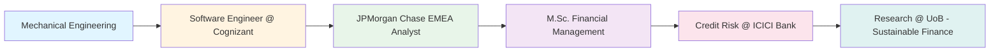

<div align="center">
  
# 👋 Hey there! I'm Abhishek Nayak

### 🔄 Turning `alpha, beta, gamma` into `101010101`
**M.Sc. Financial Management Graduate | Ex-Cognizant Software Engineer | Investment Banking Enthusiast**

[](https://www.linkedin.com/in/me-nayak-abhishek)
[](mailto:itsmenayakabhishek@gmail.com)
[](https://www.instagram.com/abhishek_nayak._/)

</div>

---

## 🚀 About Me

```python
class AbhishekNayak:
    def __init__(self):
        self.location = "Bangalore, India"
        self.education = {
            "masters": "M.Sc. Financial Management (University of Birmingham)",
            "bachelors": "B.Tech Mechanical Engineering (VIT Bhopal)"
        }
        self.current_focus = ["ESG Risk Assessment", "AI in Finance", "Quantitative Analysis"]
        self.previous_life = "Software Engineer @ Cognizant"
        
    def current_work(self):
        return [
            "🔬 Research Assistant in Sustainable Finance @ UoB",
            "📊 Developing AI-powered ESG monitoring systems",
            "💹 Building ML models for financial market analysis",
            "🏦 Previously: Credit Risk Analyst @ ICICI Bank"
        ]
    
    def tech_meets_finance(self):
        return "Bridging software engineering expertise with financial analytics"
```

---

## 💼 Professional Journey



---

## 🛠️ Technical Arsenal

### 💻 Programming & Development


### 📊 Financial Analysis & Data Science


### 🚀 Frameworks & Technologies


### 🤖 AI/ML & Analytics
- Natural Language Processing (NLP) & Large Language Models (LLM)
- Financial Modeling & Valuation (DCF, DDM, Comparables)
- Machine Learning (Regression, Classification, Time Series)
- Econometric Analysis (OLS, REM, Cointegration Models)

---

## 🎯 Key Projects & Achievements

### 📈 Financial Research & Analysis
- **Media Sentiment Impact on UK Banking**: Developed ML models achieving 87% correlation between media sentiment and liquidity patterns
- **IPO Performance Analysis**: Analyzed Wingstop (61% underpricing) and Canada Goose (25.82%) using BHAR, CHAR methodologies
- **Corporate Governance Study**: Built regression models across 86 tech firms analyzing governance impact on ROA
- **British Airways Valuation**: Led comprehensive analysis projecting £4.5M cost savings through debt restructuring

### 🏦 Investment Banking Experience (JPMorgan Chase)
- Developed pitch deck resulting in 45% increased client engagement and $42M company valuation
- Structured acquisition analysis with 25% premium pricing through fundamental analysis
- Achieved 16% annual reduction in financing costs through capital structure optimization

### 💻 Software Engineering Impact (Cognizant)
- Optimized applications supporting 50K+ users with 12% query performance improvement
- Enhanced response times by 35% through efficient caching and database optimization
- Achieved 90% test coverage across critical business applications
- Led 24x7 production support for 83 business-critical applications

---

## 📊 GitHub Stats

<div align="center">
  


</div>

---

## 🎓 Certifications & Recognition

- 🥇 **Rank 1** - Management Intern, Vikram Private Limited (FY21 Q4)
- 🥈 **Runner-up** - IBM 'Crack the COVID-19 Crisis' Challenge
- 🛠️ **SOLIDWORKS CSWP** - Certified Professional
- 🌐 **C2 Level English** Proficiency

---

## 🌱 Current Focus

```javascript
const currentLearning = {
    academic: "Sustainable Finance & ESG Risk Assessment",
    technical: "AI/ML applications in Financial Markets",
    research: "Multi-Stakeholder ESG Framework Development",
    interests: ["Quantitative Finance", "Risk Management", "FinTech Innovation"]
};

console.log("Building AI-powered solutions for sustainable finance 🌍");
```

---

## 🤝 Let's Connect!

I'm always excited to collaborate on projects involving:
- 💹 Financial Analytics & Modeling
- 🤖 AI/ML in Finance
- 🌍 ESG & Sustainable Finance
- 📊 Data-Driven Investment Strategies
- 💻 FinTech Development

### 📫 Reach Out:
- 📧 Email: itsmenayakabhishek@gmail.com
- 🔗 LinkedIn: [me-nayak-abhishek](https://www.linkedin.com/in/me-nayak-abhishek)
- 📱 Phone: +91 7008012098 | +44 7407747745

---

## 🎯 Fun Facts

```yaml
interests:
  - 🏎️ Formula 1 Enthusiast
  - 📚 Avid Reader
  - 🌱 Gardening Hobbyist
  - ⚽ Team Sports Lover
  - ✈️ Travel Explorer
  - 🤝 Community Service Volunteer

languages:
  - Oriya: Native
  - Hindi: Native
  - English: C2 Professional

mantra: "From mechanical gears to financial models, embracing continuous evolution 🚀"
```

---

<div align="center">
  
### 💡 "Bridging the worlds of technology and finance, one algorithm at a time"


**⭐ From [NayakAbhishek](https://github.com/NayakAbhishek)**

</div>

---

<details>
<summary>📈 More GitHub Metrics</summary>
<br>


</details>

<!--
**Pro Tips for maintaining this README:**
- Keep your projects section updated with latest work
- Add specific repository cards for featured projects
- Update the current focus section as you progress
- Add GIFs or custom graphics for more personality
- Consider adding a blog section if you start writing
-->
